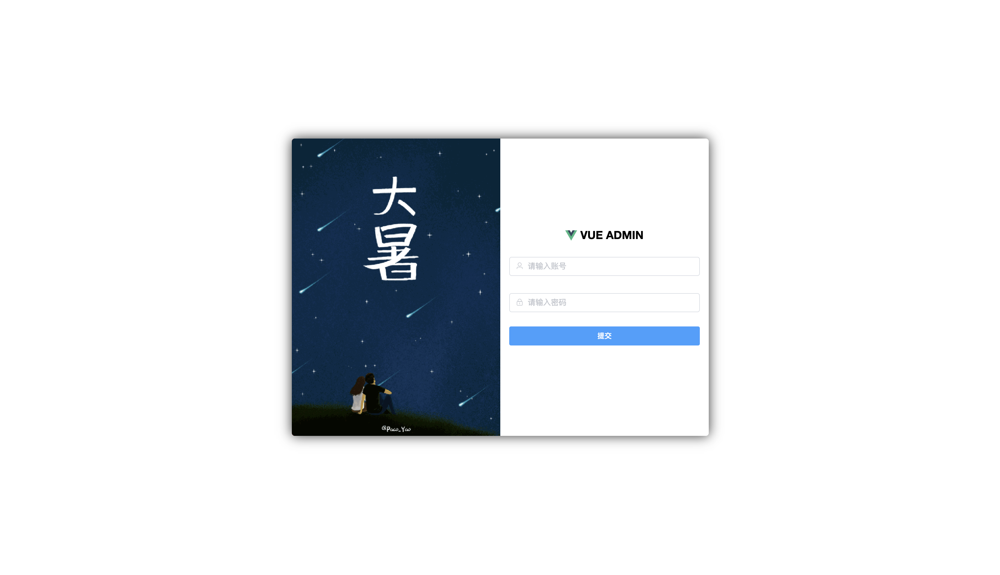
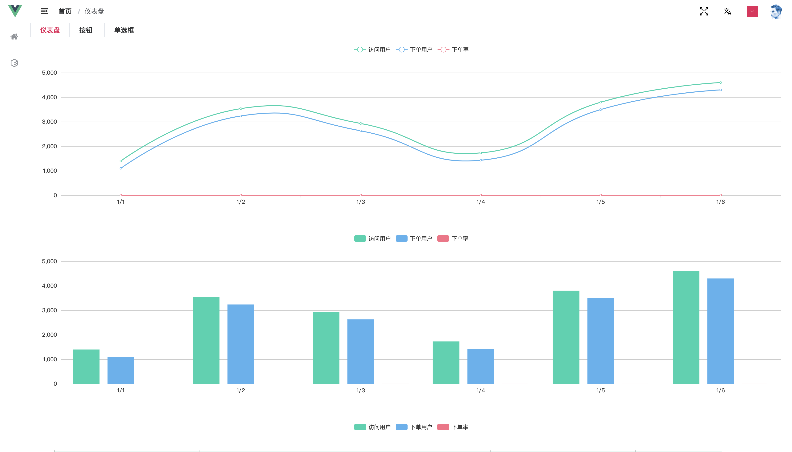

  

    
    
    
    

- ## 7 月 30 更新

  - menu.config 和 router.config 合并为一个文件配置
  - 路由配置添加 isMenuHidden 为 true 的路由是否侧边栏显示
  - 路由配置添加 meta.keepAlive 为 true 的路由将会缓存

- ## 7 月 28 更新

  - 自定义修改主题颜色
  - 多语言的切换
  - 全屏功能
  - 侧边栏和面包屑导航和 tabs 的联动
  - 路由动画
  - 路由切换顶部进度条
  - 可配置的侧边栏

- 登陆页

- 首页

