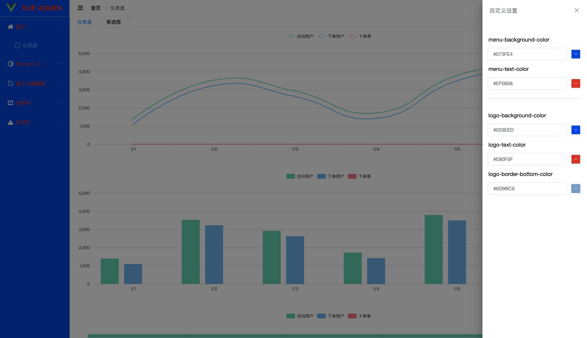

  

    
    
    
    

- ## 8 月 6 号更新

  - 自定义修改是否显示 LOGO
  - 自定义修改是否显示 tabs
  - 自定义修改 header 背景颜色

- ## 8 月 6 号更新

  - 添加自定义左侧菜单背景和字体颜色
  - 修改已知 BUG

- ## 8 月 5 更新

  - 添加音视频
  - 添加异常页
  - 修改已知 BUG

- ## 8 月 4 更新

  - 加入富文本编辑器
  - 修改已知 BUG

- ## 7 月 30 更新

  - menu.config 和 router.config 合并为一个文件配置
  - 路由配置添加 isMenuHidden 配置 路由是否侧边栏显示
  - 路由配置添加 meta.keepAlive 配置 路由是否缓存

- ## 7 月 28 更新

  - 自定义修改主题颜色
  - 多语言的切换
  - 全屏功能
  - 侧边栏和面包屑导航和 tabs 的联动
  - 路由动画
  - 路由切换顶部进度条
  - 可配置的侧边栏

> 登陆页

> 首页

> 菜单栏自定义配色

