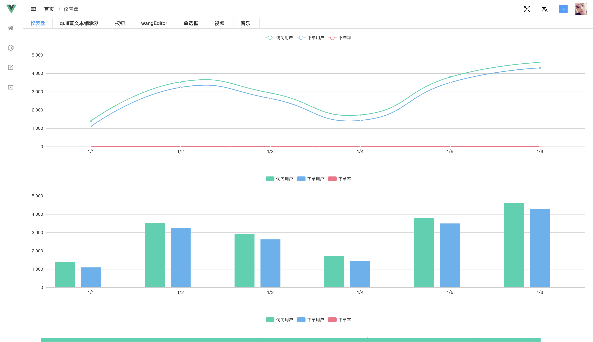

  

    
    
    
    

- ## version 0.0.1 更新

  - 自定义功能

    - 自定义修改是否 LOGO、背景、字体颜色、边框
    - 自定义修改是否显示 tabs
    - 自定义修改 header 背景颜色
    - 自定义修改主题颜色
    - 自定义修改左侧菜单背景和字体颜色

  - 路由

    - 路由配置添加 isMenuHidden 配置 路由是否侧边栏显示
    - 路由配置添加 meta.keepAlive 配置 路由是否缓存
    - 路由配置添加 meta.auth 配置 路由是否权限校验
    - 路由切换顶部进度条
    - 路由切换动画
    - 路由配置生成 menu

  - 国际化-i18n

    - 多语言的切换

  - 其他功能
    - 添加异常页
    - 全屏功能
    - 侧边栏和面包屑导航和 tabs 的路由联动

> 登陆页

> 首页

> 自定义配置

